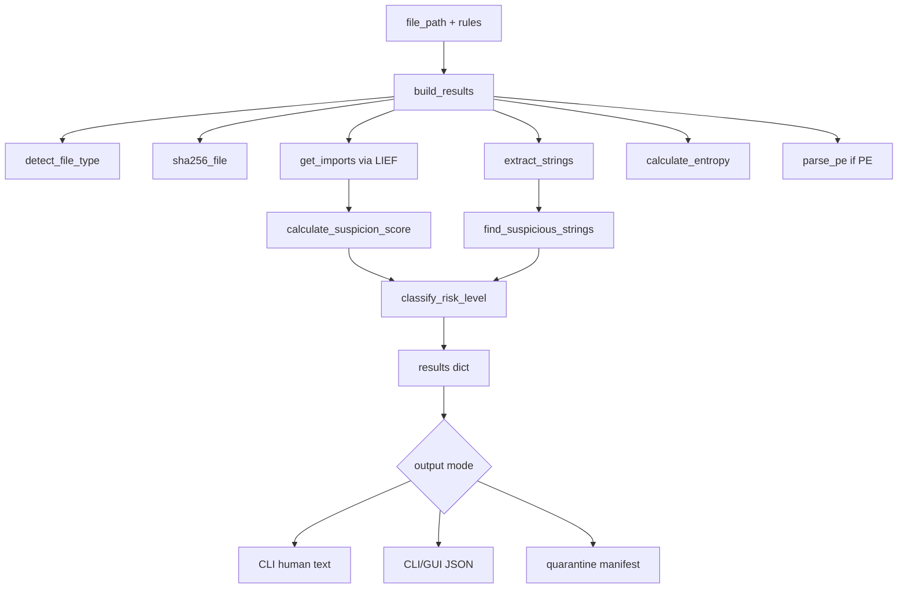

# Architecture

High-level layout of **binary-analyzer** — how modules connect, how data flows, and where extension points live.

## Entry points

| Entry | Module | Role |
|-------|--------|------|
| `python -m binary_analyzer` | `__main__.py` | Routes `--gui` to `gui.run_gui()`, otherwise `cli.main()` |
| `binary-analyzer` (console script) | `cli.py` | CLI only |
| `binary-analyzer-gui` | `gui.py` | Standalone GUI launcher |
| Python API | `__init__.py` | Exports `build_results`, rules loaders, `AnalysisRules` |

## Analysis pipeline

`build_results()` in `analysis.py` is the single source of truth. CLI and GUI both call it, then render or act on the same dict shape documented in README JSON examples.

### Results dict (key fields)

- `file_info` — size, SHA-256
- `file_type` — PE / ELF / Unknown (magic-byte detection)
- `strings` — total count + preview slice
- `imports` — count, suspicion score, matched suspicious APIs, optional `analysis_error`
- `entropy` — Shannon score + verdict string
- `pe_info` — architecture and section table (PE only; `null` for ELF/unknown)
- `suspicious_indicators*` — preview, full list, and total keyword hits
- `risk.level` — LOW / MEDIUM / HIGH
- `isolation` — populated when `--auto-isolate` fires (CLI) or user isolates (GUI)

## Module responsibilities

| Module | Responsibility |
|--------|----------------|
| `analysis.py` | Orchestrates pipeline; `detect_file_type()`, `build_results()` |
| `string_extractor.py` | Regex extraction of printable ASCII strings |
| `entropy.py` | Whole-file Shannon entropy and NORMAL/MEDIUM/HIGH verdict |
| `indicators.py` | LIEF import parsing, suspicion scoring, keyword matching |
| `pe_parser.py` | Lightweight PE header/section parser (no LIEF required) |
| `risk.py` | Risk bands from score + string counts; rank helpers for isolation |
| `rules.py` | Load/merge/validate `default_rules.json` and user JSON; env `BINARY_ANALYZER_RULES` |
| `quarantine.py` | Isolate, restore, delete, `manifest.jsonl`, CSV export |
| `cli.py` | Argument parsing, human output, isolation triggers, quarantine subcommands |
| `gui.py` | CustomTkinter HUD; background analysis thread; in-session rules load |

## Rules merge semantics

Bundled defaults live in `default_rules.json`. User JSON (CLI `--rules`, env var, or GUI “Load Rules”) merges as follows:

| Field | Behavior |
|-------|----------|
| `suspicious_imports` | Merged; same key overrides default weight |
| `risk.high` / `risk.medium` | Merged per sub-field |
| `suspicious_string_keywords` | **Replaced** entirely if present in user file |

`rules.source` in output records `package-default` or the absolute path to the effective rules file.

## Quarantine workflow

1. Analysis completes; isolation triggers evaluated (`cli.isolation_triggers` or GUI button).
2. `isolate_file()` moves the binary to `<quarantine-dir>/<sha256>_<name>.quarantine` and sets read-only permissions.
3. `append_manifest()` appends one JSON line to `manifest.jsonl` (timestamp, paths, hash, scores, triggers).
4. Review via `--list-quarantine`; restore or delete by SHA-256 prefix; export CSV for reporting.

Restore requires the original destination path not to exist; hashes are verified after move.

## Build and packaging

`build.py` uses PyInstaller with generated `_entry.py` / `_entry_gui.py` shims (gitignored). CI `build.yml` produces CLI + GUI binaries per OS on version tags.

## Tests

`tests/` focuses on risk logic, rules merge/validation, mocked `build_results`, CLI isolation composition, and manifest/CSV helpers. See README for the current test count.
